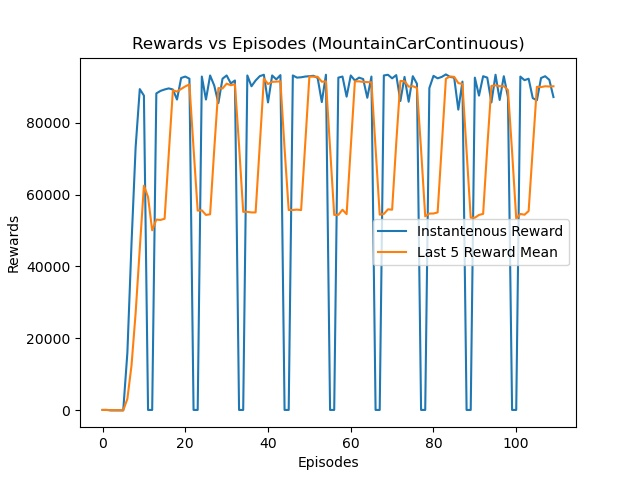

# Reinforcement-Learning-DDPG-PyTorch
 DDPG algorithm implemented with PyTorch and tested on several OpenAi Gym environment. 

## Pendulum

An agent has been trained with DDPG the result of the reward function is as following:

## Mountain Car Continous 

An agent has been trained with DDPG the result of the reward function is as following:

Reward is defined as:
= 100 to achieve Flag o.w. = - action^(2) * 0.1

 
