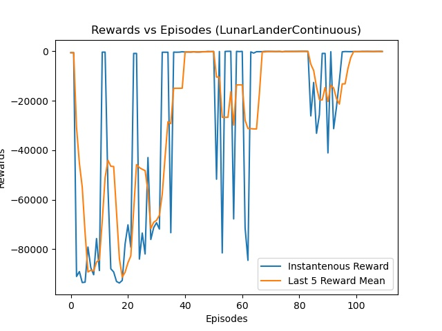

# Reinforcement-Learning-DDPG-PyTorch
 DDPG algorithm implemented with PyTorch and tested on several OpenAi Gym environment. 

## Lunar Lander Continuous

An agent has been trained with DDPG the result of the reward function is as following:

## Mountain Car Continous 

An agent has been trained with DDPG the result of the reward function is as following:

Reward is defined as:
= 100 to achieve Flag o.w. = - action^(2) * 0.1

## How to See the Trained Agents on Work ? 

Easy! 

1- Go to file "ResultActorNN" and take the actor networks. 

2- Donwload the .py files and open the "TestLunarLanderContinuous" or "TestMountainCarContinous".

3- Hit run. 

Further questions ?? ---> bremer.yilmaz@gmail.com 
